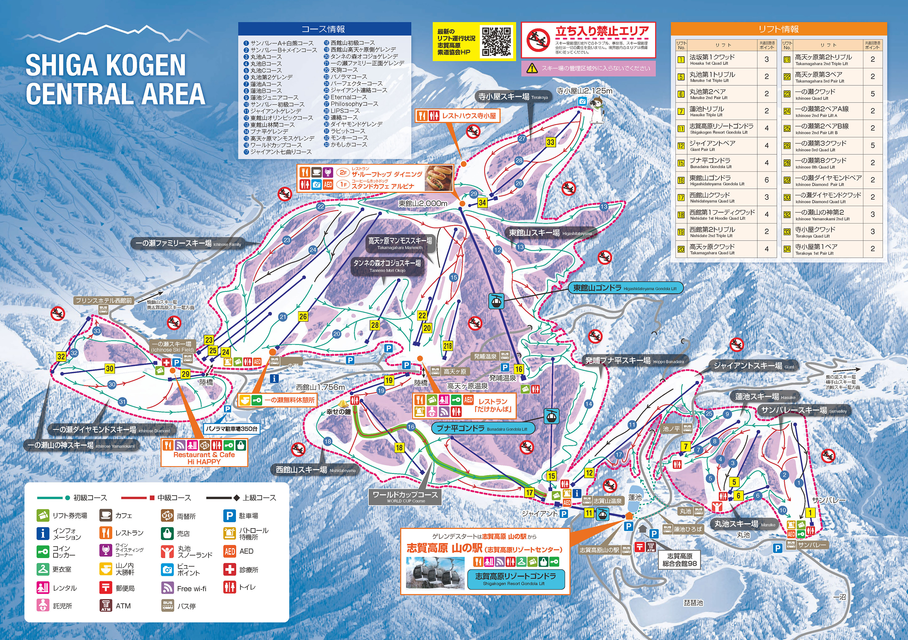
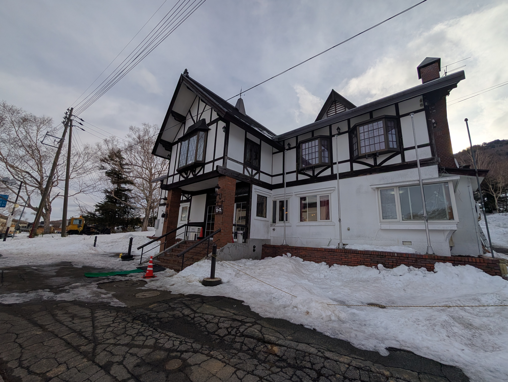
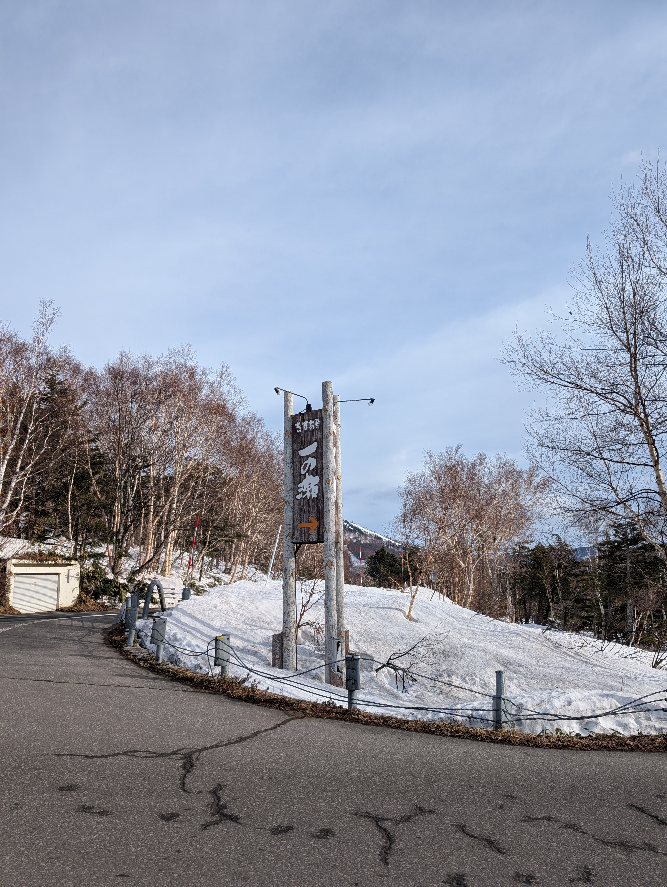
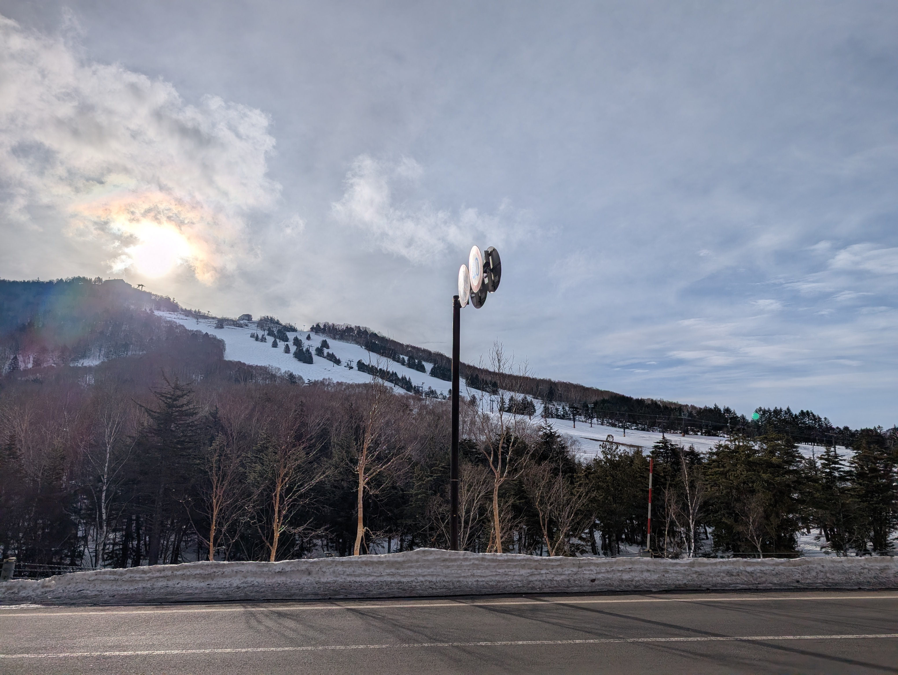
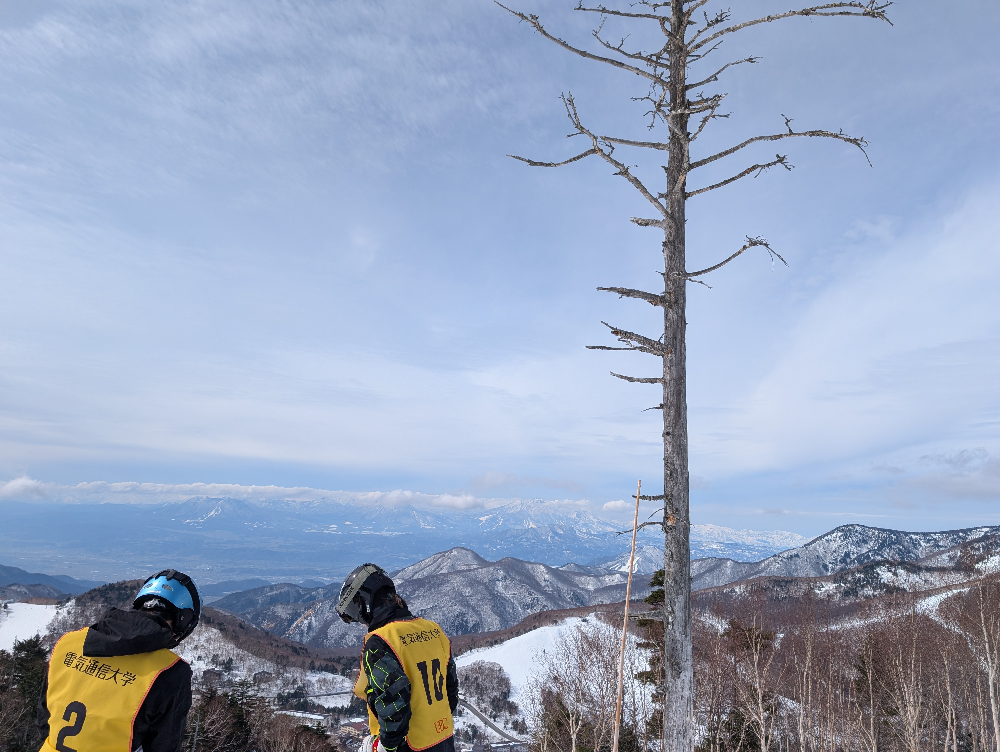
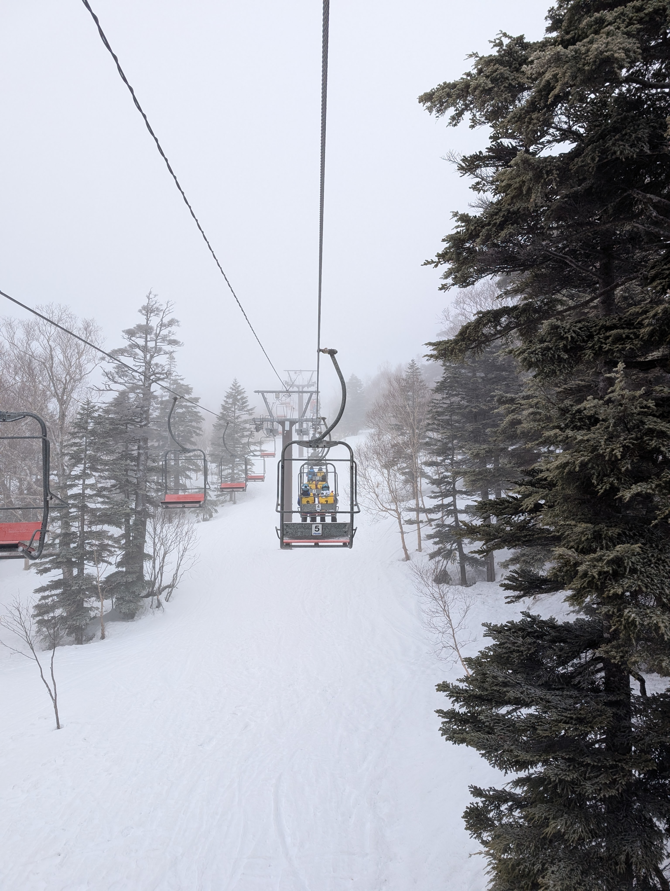
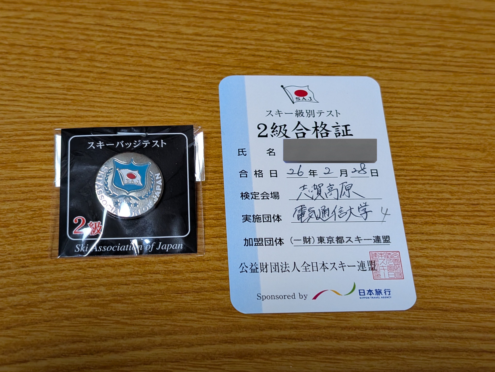
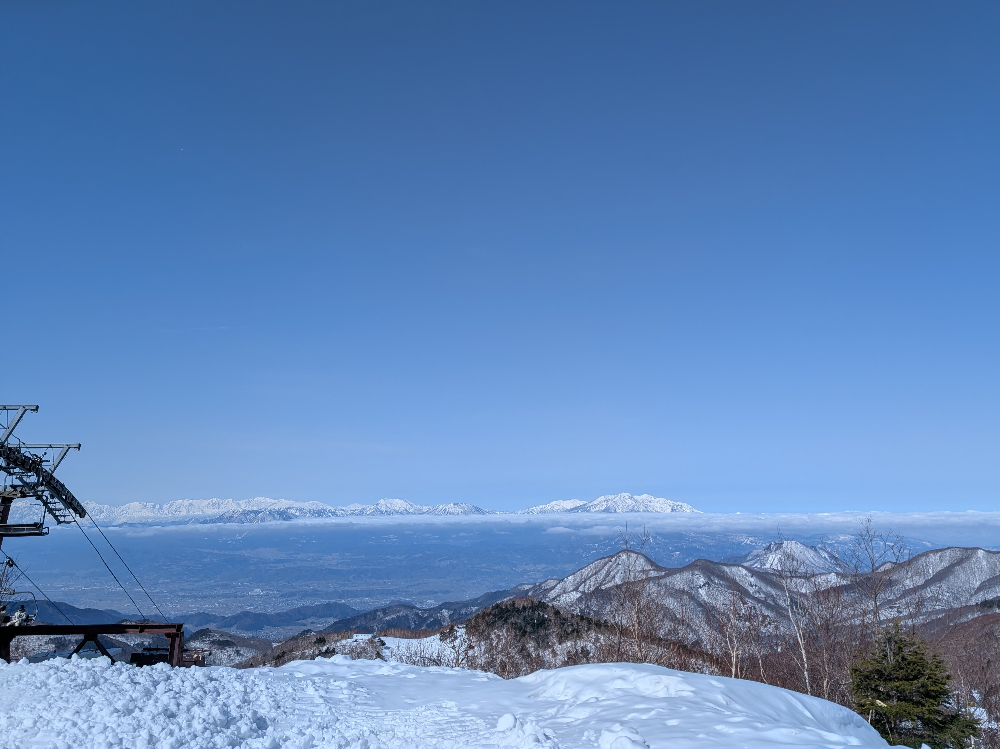
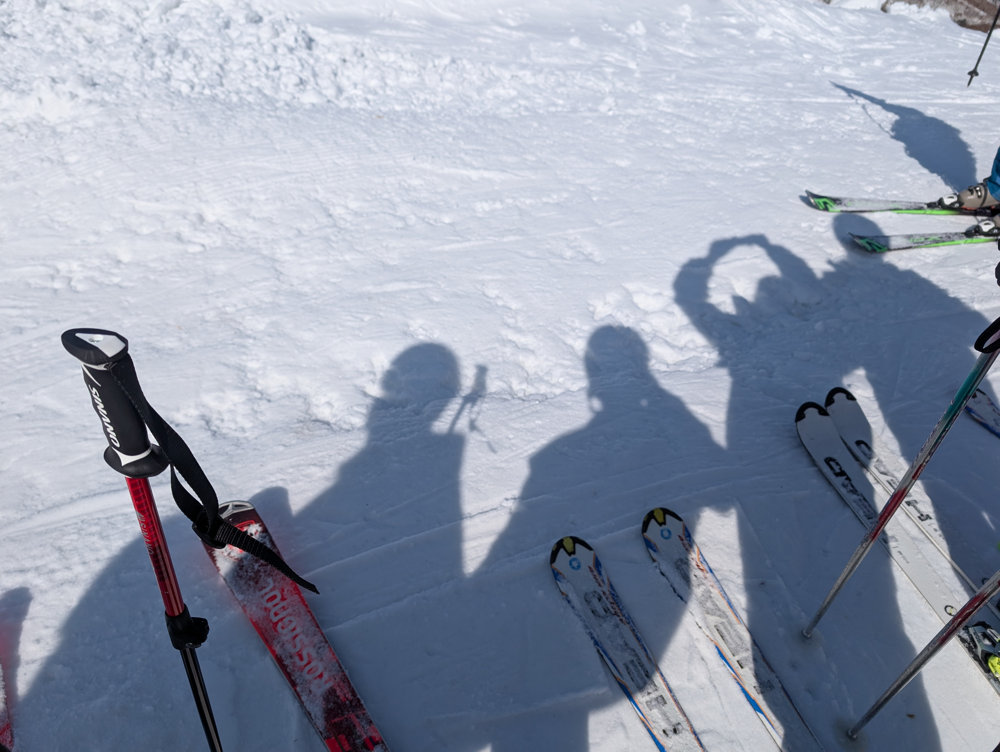

電通大の2年次の授業の1つに、生涯スポーツ演習というものがあり、選択で冬休みに4日間のスキー合宿に行くことができる。

毎年抽選になるほど希望者が多い人気科目だが、自分は運よく参加することができた。

## 場所

([志賀高原中央エリアのホームページ](shigakogen.co.jp)より)

志賀高原の中央エリア、「タンネの森オコジョスキー場」の前にある「ホテルむつみ」に宿泊し、そこを起点にエリア内を巡った。

↑ホテルむつみ

志賀高原広すぎる、やばい。

志賀高原に行くのは初めてだったので、自分が今どこにいるのか分からなくなりそうだった。

## 1日目 (2/26)

大学の講堂前に6:45集合、7:00にバスが出発した。

荷物はスキー用具とウェアを事前に全てホテルに送り、着替えも下着以外は着回すようにして削減したところ、普段の通学用リュックサック+トートバッグひとつに収まった。

荷物は小さければ小さいほどいいと思っている。

11時半ごろに到着し、食堂でお昼を食べた。

午後からいよいよスキーが始まり、仮の班分けに従って、自分のいる1班は1〜3班合同で滑ることになった。

一人ずつ滑りを先生たちが見て、点数をつけられ、2日目からの班が確定した。自分は1班継続となった。

---

夜は班ごとにミーティングがあり、それぞれの担当の教員の講義を受け、レポートを書いた。

我々の先生は、運動の理論からスキーでの体の使い方を丁寧に説明してくれた。

班によっては軽く自己紹介するだけで終わったところもあったらしい。

レポート提出と入浴が22時まで、消灯が23時となっていたため、やることが片づいたあとは友達の部屋でトランプで遊んだ。

## 2日目 (2/27)

朝は7時に起床、9時にスキーの準備をしたうえで集合となっていたが、朝食をとってから時間があったため、友達とホテル周辺を散歩した。

天気がよく、気持ちのいい朝だった。

---

この日は丸一日かけて中央エリアのほぼ全てのゲレンデを巡った。

暑いくらいの晴天だったが、雲海が見えたりと、志賀高原の標高の高さを満喫できた一日だった。

また、1〜3班は3日目に2級の検定を受ける班となっているため、それに向けて各種目の要点を確認した。

---

夜は講義はなく、ナイターに行くことができる(追加で1500円かかるけど)ということで、サークルの人たちで集合して行ってきた。

場所は一ノ瀬ファミリースキー場だったが、ナイターで使えるリフトが1本の低速ペアのみで、降りたところが若干急になっていたり、ホテル目の前のタンネの森がナイター対応していないため、平坦な連絡通路をがんばって行き来しないといけないなど、初心者には少し優しくないとは思った。

とはいえ、違う班の人と一緒にスキーができるいい機会ではあった。

## 3日目 (2/28)

1, 2日目とはうって変わって、天候が悪い一日だった。

午前中はとくに、吹雪いていて視界が悪く、超寒かった。

そんな中、一ノ瀬ファミリースキー場で検定の練習をした。

お昼を食べ、午後1発目から検定となった。

---

2級の検定は次の3種目の合計点で合否が出る。

- シュテムターン
- 小回り
- 大回り

各種目の得点は3人の検定員がつけた点数の平均であり、3種目合計で195点以上で合格となる。

検定員は1〜3班の先生3人が担当した。

自分は小回りが不安要素で、本番で満足のいく滑りができたかは正直微妙だった。

検定では、途中でコケたりすると合格は絶望的になるため、全員ものすごい緊張感のなか臨んだ。

---

夕飯を食べたあとに検定の合否発表があり、自分は無事2級に合格することができた。

今回は1〜3班の29名が受験し、26名が合格した。

自分の得点は、シュテム67点、大回り67点、小回り66点で、合計200点だった。

200点にいっていたのは26人のうち3人だったため、なかなかよい結果だったと思う。

トップの人は3種目とも68点を出していて、実際周りから見ていても特に綺麗な滑りをしていた人だったため、すげ〜と思っていた。(語彙力が敗北している)

---

この日もナイターに行くことができる日だった。

自分は検定の疲れで行く気はなかったのだが、思ったよりも早くレポートを仕上げることができ、他の人がみんなナイターに行ってしまって暇だったので、結局料金を払って途中からナイターに行った。

夜はわりと天気もよくなっていて、普通に楽しめたが、いよいよ体力の限界を感じ始めていた。

## 4日目 (3/1)

朝の放送で、ホテルの人が外気温-4℃と言っていた。

冷え込んではいるが天気はよく、雪の状態は最高だった。

この日はお昼までで、2時間ほどしかなかったため、検定後とうのもありユルい雰囲気でスキーを楽しんだ。

昼食や入浴を済ませ、荷物をまとめてバスに乗り込んだら、そこからは東京までの長い移動が始まった。

途中、中野(長野県にも中野という場所がある)でお土産を買ったりできたが、あまりにも地元すぎてなんともいえない気持ちだった。

疲れていたのもあり、自分はほとんどずっと爆睡していた。東京入ったあたりで渋滞があったらしいが、寝てたので気づかなかった。

19時ごろに大学に到着し、解散となった。

## 感想

全体的に有意義な演習だった。

安く志賀高原でスキーができる、しかも宿、飯、インストラクターつきというのがなかなか良かった。

しかも、SAJ 2級を取得できたし、ついでに単位も取れるので、行かないという選択肢はないといっても過言ではない(諸説あるが)。

そもそも志賀高原は広くてゲレンデのバリエーションが多く、標高が高いため雪質もいいので、来シーズンはプライベートで行きたいと思った。

今後の自分の課題としては、不整地やコブへの対応がまだまだ未熟であるから、そういう弱点をなくしていきたい。

スポ演Dはスキーに興味がある人にはめちゃくちゃおすすめなので、ぜひ取ってみてください。

おわり
