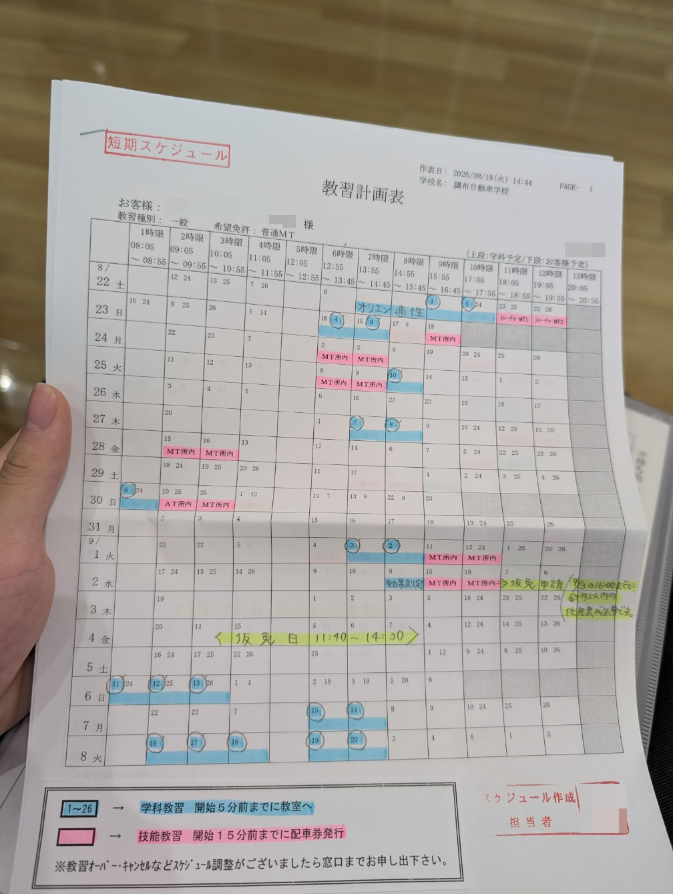
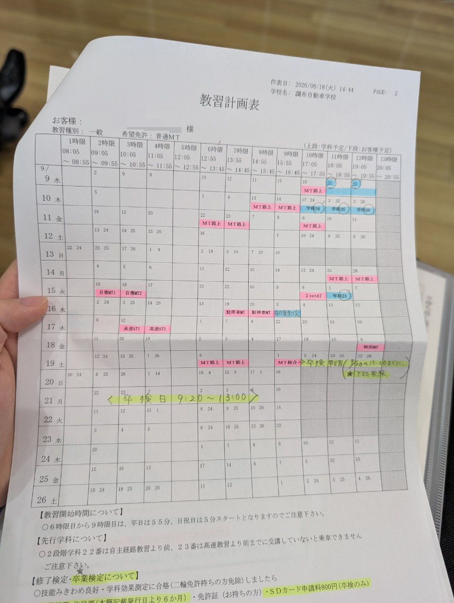
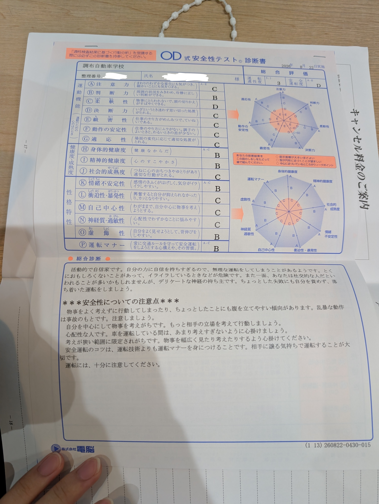

## 免許を、取ります
夏休みなのでそろそろ免許取るか〜ということで、調布自動車学校に入校した。

大学入学した頃からずっと家族から催促されていて、自分でも周りの免許持ちに対して羨ましい気持ちもあったが、なかなか一歩が踏み出せず3年の夏休みまできてしまった。

~教習はなかなか情報量が多く、自分で整理するためにも、毎日書き残せていけたらと思っている。~

<Note>
↑結局、毎日書くなんてマメなことできるわけもなかったので、仮免までで一旦区切って書きます。
</Note>

## 入校までの話
まず、車の免許を取るといっても色々選択肢があった。

- ATかMTか
- 通いか合宿か
- 教習所はどこにするか

まず、免許の種類について。当然ATのほうが安くて簡単で期間も短く済むのだが、自分はMTを選択した。

小さい頃から車が好きで、いわゆるスポーツカーの類に憧れがあったし、車の仕組みにもめちゃくちゃ興味があったからだ。

次に、通いか合宿かについて。

合宿なら最短で取れるし地方にいけば安く取れそうなので夏休み期間には最適だろう。

ただ、自分は数週間丸ごと東京を離れることに抵抗があり、バイトもしたかったので、通いを選んだ。

通いだと自分のような怠惰な人間は確実に教習期限ギリギリまで先延ばししてしまう気がする。

そこで、大学生協経由で申し込める夏休み期間の短期プランというものを使うことにした。

[2026夏の短期スケジュールプラン](https://manabi.univcoop.or.jp/drive/tsugaku/tk/pdf/2026tankisummer.pdf)

このプランは、教習所がなるべく最短で免許が取れるようにスケジュールを組んでくれるようになっていて、要は通いと合宿のいいとこ取りのようなものだ。

しかも、教習所によってはスケジュールが一部調整可能で、こちらがバイトなどで行けない日程を除外してスケジュールを組んでくれる。

そして、自分の最寄りの調布自動車学校がこれに対応していたため、ここに決めた。

8月前半はお盆の帰省などが入っていたため、

- 申し込み: 7/25
- 入校手続き: 8/17
- 教習開始: 8/22

となった。

## 入校手続き(8/17)
申し込みの段階でお金は振り込んであったので、入校手続きはスムーズに進んだ。

- 住民票
- 学生証
- 印鑑
- ICカード

だけ持って手続きに行った。

ICカードは教習原簿の取り出しや配車券の発券に使うらしい。

タッチ決済付きクレジットカードでもいいと書いてあったため、NFC全般いけるのかもしれないが、明記されていてわかりやすいのでSuicaを持って行った。

受け付けに行くと申し込み用紙書いてね〜と言われたので、住民票の事項を書き写したりして記入欄を埋め、提出。
するとその場で機械を覗くタイプの視力検査と、教習所内で使う用の写真の撮影をした。

ここまで流れるように進み、手際いいな〜なんて思っていた。よく考えたらそりゃそうである。毎日入校してくるわけだから。

次に、スケジュールの話になった。既に教習所側がおおよそのスケジュールの紙を用意してくれていて、都合の合わない時間に線を引いて返した。

教習開始日(8/22)については、最初にオリエンテーションを受けることは決まっているので、そのタイミングで完成版のスケジュールをもらえるという話だった。

また、教習所での時間割や教習原簿の扱いについての軽い説明もうけた。

- 教習開始15分前から窓口横のPCでICカードをタッチして教習原簿を受け取ることができる
- 技能教習は教習開始15分前までに窓口横のPCでICカードをタッチして配車券を発行する必要がある
- 技能教習についてはどうしても15分前に間に合わない場合、電話すればスタッフが代わりに配車券を取ってくれる
- ただし4分前の予鈴には教習の教室なり車の場所なりに居る必要がある

また、技能のキャンセル待ちについての紙ももらったが、今回のプランは技能の予約をすべて取ってもらっているので使う機会はなさそうだ。

教習手帳と教科書、路上で使う地図などの一式が入ったバッグを受け取り、この日は帰宅となった。

## 教習1日目(8/22)
オリエンテーションが13:55からなので、13:40になったタイミングで教習原簿を受け取った。

このとき一緒にスケジュール表ももらった。

わかってはいたけど、なかなかハードなスケジュールである。

## オリエンテーション
まずはオリエンテーションで教習の受け方やルールを説明された。

- 学科教習は講義開始4分前の予鈴で教習原簿に教習手帳を挟んで教員に渡す
- このとき原簿が入ってたクリアファイルは鞄にしまう
- 講義中必要なもの(学科教本と筆記用具)以外もすべて鞄にしまう
- 予鈴のタイミングに間に合わない場合は直接隣の教員室に渡しに行く
- スマホ、スマートウォッチなどは音の出ない設定にして鞄にしまう、ポケットはNG
- 技能教習は原簿、手帳、配車券をファイルに入れて用意しておき、予鈴のタイミングで車に移動する
- 原簿は持ち出し厳禁、配車券出すPCの隣でスタッフに返す

とにかく強調されたのは、原簿は公文書であるから厳重に扱う必要があること、技能は当日キャンセルでお金がかかることなどだった。

この日は何も考えずにPixel Watchを付けていったので、ここで鞄に封印した。

明日からは普通の時計つけてこようと思った。

休み時間は10分だけど、予鈴には着席している必要があるから、実質6分しか休みがない。

また、学科教習中に寝てしまったりすると普通に単位を落とす。(当たり前だが)

高校や大学に比べてだいぶシビアだと感じた。

## 適性検査
次の時間は適性検査。

問題、回答用紙、ボールペンのセットを渡され、簡単なテストを受けた。

問題の内容について細かく触れても意味がないから書かないが、結構時間がなくてすぐ回答終了になってしまった。
結果は次の学科教習のときに教習手帳に挟まれていた。

ばか正直に答えたのであんまいい結果じゃない。

こんなんでいいのだろうか。

---

## 学科教習 1~10
学科は最初の1番講義以外は順不同で受講できるので、基本的にスケジュールに沿いつつ、空いている時間を見つけて1限の分を他の日に回したりして進めた。

予鈴の時間になると、前の時間の担当だった先生が机をまわるので、原簿と手帳を手渡す。

50分の前半は先生がスライドを交えながら講義をおこない、後半は映像を見るという形式だった。

先生の講義は教本の内容に沿いつつ、ところどころ補足の情報や、試験でどういう出され方をするのかなども教えてくれるので、教本に書き足す形でメモを取った。

こういった補足情報を得られるのは、対面講義の教習所の良いところだと思う。

映像のほうは、正直めちゃくちゃ眠かった。学科がオンラインになっている教習所にしなくて本当によかった。

### 仮免前効果測定
第一段階の学科を全部取り終わると、効果測定というものを受ける必要がある。

これは、仮免の学科試験と同じ形式の問題をPCで受ける模擬試験で、これに合格しないと仮免試験の予約ができない。

1日1回まで、任意の時限で受けることができる。2階のスーパードリル室というところに原簿と手帳を持っていき、予鈴のタイミングで回収される。

このとき、スーパードリル室のパソコンでアカウントの登録が必要なので、少し早めに行っておくといい。

50問の正誤問題で、合格ラインは9割の45点。

とりあえず学科を全部取りきった日(スケジュール上での効果測定の前日)にノー勉で受けてみたら43点で不合格だった。

こういうのはちゃんと対策するほうがいい。

そして翌日受け直して46点、ギリギリ合格できた。

## 技能教習 15H
技能教習は学科と並行して進んだ。スケジュールを組んでもらっていたため、その通りに進めれば予約やキャンセル待ちは必要ない。

配車券を前の時間に取るのを忘れるとまずいが、自分はちゃんとスケジュール通りに進めることができた。

初日の学科1番のあと、トレーチャー教習という、シミュレーターを使った教習を2時間受ける。

言われた通りに操作するだけだが、あとから考えると実車の感覚とはだいぶ違ったと思う。

実車に乗った最初の数時間は、クラッチ操作がうまくできず、発進で手間取ったりエンストしまくったりと、本気で挫折しそうになった。

第一段階は教習所内のコースを運転するわけだが、最初はMT車の運転の仕方を練習し、だんだん法規に従った確認・合図などを交えて運転できるようにする流れだった。

後半は、検定での課題(S字、クランク、坂道発進、踏切など)の練習もした。

自分はとくに坂道発進が苦手で、検定直前まで不安要素だった。

技能教習の15時限目、最後の教習はみきわめとなっていて、それまでの教習がちゃんと身に付いているかの確認と、検定で合格点を取れる見込みがあるか判断される。

自分は無事一発でみきわめ良好をもらえた。

みきわめ良好と効果測定合格をもって仮免試験の申し込みをしに窓口に行った。

スケジュールを組んでもらってあるので、仮免試験の仮予約がされていて、スムーズに申し込みできた。

## 仮免試験 (9/4)
11:40集合で5分前に2階の検定控室に行き、そこで検定の流れの説明を受けた。

まずは技能試験をおこない、その合格者は学科試験を受ける。

3人1組のグループで車に乗り、順番に決められたコースを回って点数がつけられる。

ちなみに減点方式で、100点満点から減点されていき、70点が合格ラインとなっている。

信号無視や、脱輪したまま進んでしまうなどの重大なミスをすると、検定中止となり一発不合格になるから気をつける。

この日は自分含めて6人しかいなかったので、車は2台だけで、その時間他の所内教習の車もいなかったため、コースはがら空きだった。

しかもMTは自分だけ、みんななんでMT取らないんだろう。

心配だった坂道発進もスムーズにでき、他に大きなミスもしなかったので、無事技能は合格できた。

普段の教習と違い、検定のときは4人乗車で重量が増えているので、いつもよりしっかりアクセルを吹かすのを意識したからかもしれない。

そのあとは学科試験で、効果測定と同じ形式の問題をマークシートで答えた。

14時すぎに試験が終わり、第二段階の軽い説明を受けて終了した。

学科試験の結果は警察に送って採点されるらしく、この日の夕方17時にWebで合格発表があった。

ということで無事仮免許を取得できたので、これからは路上教習が始まる。

このまま最短で取れるように頑張りたい。

おわり
