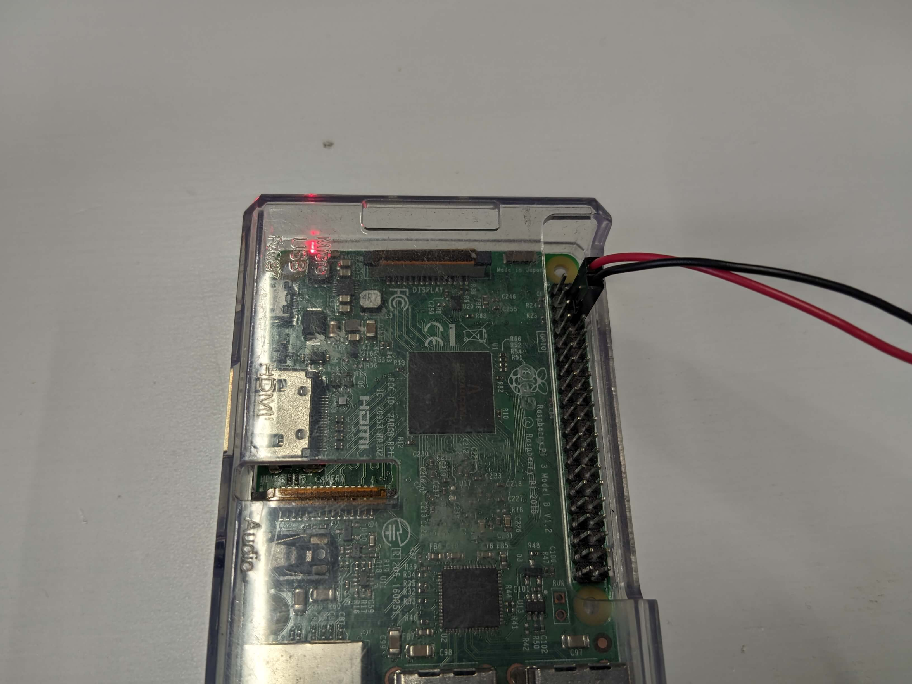
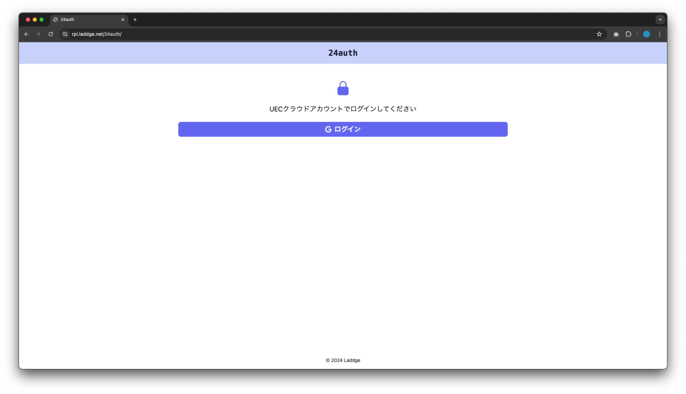
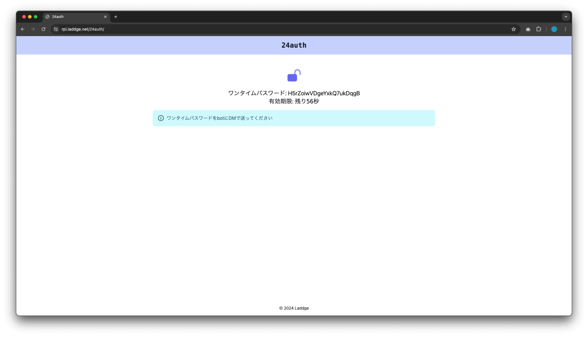

**この記事は、工研新歓ブログリレー7日目(4/7)の記事です。** 大幅に遅れて申し訳ないです。

↓まとめ

https://www.koken.club.uec.ac.jp/event/shinkan/2024/

↓ 6日目

https://gotti.dev/post/koken_blog_relay_2024/index.html

↓ 8日目

Coming soon...

## 自己紹介
こんにちは、UEC24のLaddgeです。

数日前に電気通信大学に入学し、工学研究部に入部したオタクです。

自由にものづくりができる工研には、受験前から興味がありました。

新入生の私がブログリレーに参加するのはちょっと変な話かもしれませんが、ちょうどいい話題があるので書いてみました。

## はじめに
今回は、DiscordのUEC24の鯖にいるメンバーを電通大生に限定するために、認証機能を作りました。

というのも、現状UEC24鯖はTwitter等に招待リンクを公開していて、厳密には誰でも入れる状態になってしまっています。

このままだと、今後StudentHubに移行したり大学の情報を流すのに不都合が生じるため、なんとか電通大生以外を追い出せないかと考えました。

(実際には今のところ外部の人はいなそうですが、いつ大学側からチェックされても胸をはって電通大生だけの鯖ですよ！と証明できるようにしたかったのです。)

## 認証方法

自宅鯖のラズパイに、認証ページを表示するWebサーバーとDiscordのbotを常駐させて、画像のような手順で認証するようにしました。

最初、Webページにアクセスすると、UECのGoogleアカウントでログインするボタンがあるので、それを押すとログインできます。

この際、Google側のほうで、使用可能なアカウントをUECの組織内のみに限定できるので、ログインに成功した時点でそのアカウントはUECのものであると証明できます。

そして、ログイン成功時のみワンタイムパスワードを生成して表示します。

あとは、そのワンタイムパスワードをDiscordのbotにDMで送信すると、DMの送り主に「認証済み」というロールが付与されます。

そして、一定期間後にそのロールがついていないメンバーをキックするという計画です。

## サーバーの用意
今回は私が中1の誕生日に入手してずっと使用している**Raspberry Pi 3 Model B**を実家からもってきたので、これをサーバーとします。

↑この子

私は寮住みでインターネットを契約してあるので、自室にラズパイを常駐させて使います。

常駐させるにあたり、安定した電源を確保する必要があるのですが、ラズパイ3BはMicro-Bの口に3A(正確には2.5A以上)を流しこむ必要があります。

が、レガシーなUSBに3Aも流すACアダプターなんてそうそう見つからないので、電源を自作することにしました。

実は、ラズパイのUSB Micro-Bの口は内部でGPIO(電子工作等に使うピンが生えているやつ)の5VのピンとGNDのピンに繋がっているので、直接GPIOに5V/3Aを流しこめばよいとされています。

USBである必要もないので、汎用のACアダプターのケーブルをぶった切って少し加工すれば使えます。

今回は、たまたま大学の生協に5V/3AのACアダプターが売っていたので、これを使用します。

↑これらを用意しました。工研の部室に持ち込んで、

↑切って、

↑繋げて、

↑覆って、

↑完成！！

あとはGPIOのピン配置に気をつけながら接続すると、

無事起動しました！！

工研の部室は工具などがいっぱい揃っていて、色々作業するのにめちゃくちゃいい環境になっています。

あとは、開発やサービス公開のために、TailscaleとCloudflare Tunnelを利用してますが、今回は割愛します。

## 実装
いざいざソフト側の実装をしていきます。

今回は、WebサーバーとDiscord botをそれぞれPythonで開発し、Dockerのコンテナを2つ建てて運用しています。

ソースはGitHubのリポジトリにあるので、よかったら見てみてください。

https://github.com/laddge/24auth

ここでは、根幹の部分の実装のみ説明します。

### Web
PythonのWebフレームワークとして、FastAPIというものを選びました。

https://fastapi.tiangolo.com/

このフレームワークは、ドキュメントが親切なので好きです。

Googleでログインさせる部分は、以下のサイトを参考にしました。

https://zenn.dev/kou_kawa/articles/10-oauth20-fastapi

Google Cloud PlatformでUECのアカウントを使用してプロジェクトを作成すると、組織内のユーザーのみにアプリケーションを公開する設定が選べるので、これを使って外部のユーザーを弾くようにしました。

(ここは[いーちゃん](https://twitter.com/e_chan1007_u)に教えてもらいました。)

ワンタイムパスワードの生成は、shortuuidというライブラリで短いUUIDを生成して利用しています。

ちなみに、UUIDというのは、「重複しないものとみなせるランダムな文字列」だと思っていてください。

認証の細かい流れは、

1. トップページにユーザーがアクセス
2. ログインボタンを押すと、Googleのログイン画面に遷移
3. 認証後、コールバックのURL(今回はトップページと同一)にパラメーターをつけて遷移される
4. パラメーターを解析してログインに成功したか確認
5. 確認できたら、ワンタイムパスワードをjsonに保存し、ブラウザに表示

となっています。

本来であれば、データベースに保存したほうがよいと思いますが、今回は開発時間が限られていたため、雑な設計になってしまいました。

とはいえ、問題なく動いています。

### Discord bot
Discord bot側では、Webのほうで書きこんだjsonファイルと、DMに送られてきたワンタイムパスワードを照合し、正しい場合のみ認証済みのロールを付与する実装になっています。

こちらもPythonで書きました。

jsonファイルに書きこんだ時のタイムスタンプを一緒に含めるようにしてあるので、有効期限が切れているかどうかはDiscord bot側で判定しています。

こっちは特に特別な処理はしていないので、かなり単純になっています。詳しくはソースコードを読んでみてください。

## おわりに
完成品は以下のようになりました。

(スクショ撮った順が違っていてワンタイムパスワードが別物ですが気にしないでください。)

こうして認証機能をつけたところ、大変多くの人が使ってくれました。記事執筆時点で、Discord鯖595人中487人が認証済みになっています。

ユーザー側の操作を可能な限り単純にしたので、簡単にできたという声も聞けました。

このように、日常のちょっとした不便な点などを、プログラミングができると自力で便利にできます。

この記事を読んでいるみなさんもぜひ、色々なものを作ってみてください。

また、工学研究部では、様々な分野に強い人たちが色々なものを製作しています。

自分で好きなものを作ったり、先輩たちに教えてもらったりできるので、興味がある方はぜひ部室にお越しください！
