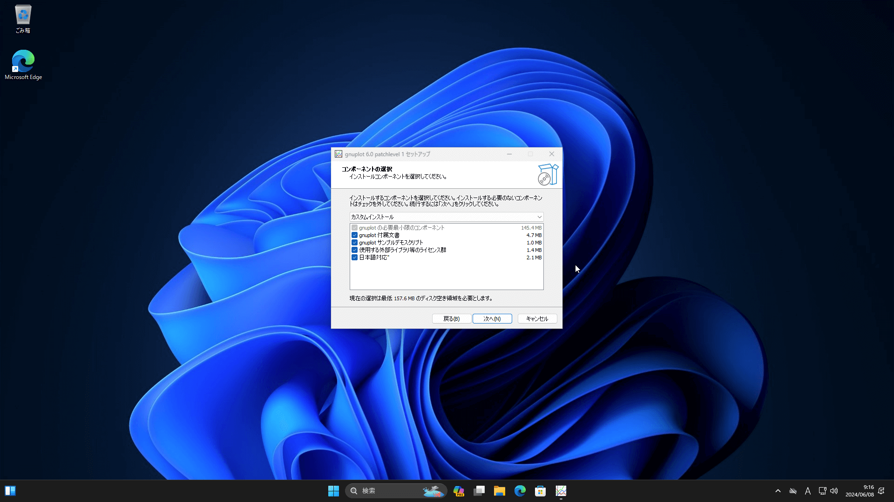
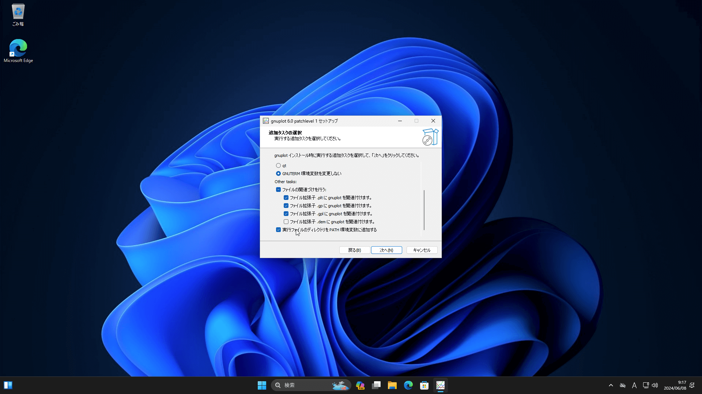
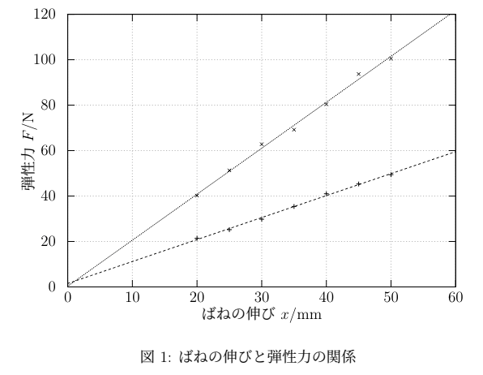

## はじめに
電気通信大学のB1には、「基礎科学実験A」という[~エクストリームスポーツ~](https://ansaikuropedia.org/wiki/%E9%9B%BB%E6%B0%97%E9%80%9A%E4%BF%A1%E5%A4%A7%E5%AD%A6)科目があり、実験のレポートをPDFで提出する必要があります。もちろん必修。

ちなみに、電通大で「謁見」というとこれのことを指します。

レポートはWord等のオフィスソフトで作成してもいいのですが、書体(立体で書くべきところと斜体で書くべきところがある)やレポートに添付する図や表のキャプションを付ける位置など、さまざまな「おさほう」に対応するのが面倒なので、代わりに$\LaTeX$という組版ソフトを使用すると、そこらへんをよしなにやってくれるので、電通大には$\LaTeX$でレポートを書いている人がたくさんいます。

$\LaTeX$を使うだけで綺麗なレポートが作れるので、これから謁見をやる人はぜひ使ってほしいです。

さて、この記事では、あえて$\LaTeX$の導入方法などは書きません。なぜなら、他の電通大のすごい先輩たちが詳しく書いてくれているからです。

↓ おすすめはこのへんの記事です。

https://zenn.dev/e_chan1007/articles/8029f3f9dff2be

僕の記事では、謁見のレポートを書くうえで必要になるグラフを、いい感じに作成する方法を紹介します。

なお、グラフの作成の仕方はいくつもあるので、選択肢の一つとして見てもらえるとうれしいです。

↓ 他の方法の一つとしてPythonを使う方法を友達が書いているので、よかったらそっちも見てみてください。

https://note.com/js2fzh/n/n4ebe87a23c8a

## gnuplotとは
タイトルにもあるように、この記事ではgnuplotなるものを使用してグラフを作成する方法を紹介します。

gnuplotは、グラフ作成に特化したソフトウェアで、オープンソースかつ無料です。ｵ-ﾌﾟﾝｿ-ｽｻｲｺｳ!!!!!

http://www.gnuplot.info/

ちなみに読み方は「ニュープロット」だそうです。

Excelなどでグラフを作るのと違い、テキストでグラフの仕様を入力するとグラフを出力してくれます。

これを使うと何が嬉しい、後述する方法で書くとグラフを$\TeX$形式で出力してくれて、そのまま$\LaTeX$に埋め込むことができるんですよ！最高！！

グラフの軸ラベルや凡例がそのままテキストとしてレポートに埋め込まれるので、**フォントを本文と統一することができます**。

## gnuplotのインストール
さっそくgnuplotをインストールしましょう。

WindowsとMacOSでの場合を書きます。~Linuxを使っているような人は自力で調べられそうなので割愛します。~

### Windowsの人
Source ForgeからDLするのがいいようです。

https://sourceforge.net/projects/gnuplot/files/gnuplot/

「Download Latest Version」という緑の大きなボタンをクリックするとダウンロードできます。

ダウンロードした.exeファイルを実行するとインストールできます。
基本的に次へを連打でいいですが、以下に示す2箇所だけ変更してください。


✅ 日本語対応


✅ PATHを追加

インストールできたら、Terminalを開いて、`gnuplot --version`というコマンドを実行して、インストールされていることを確認してください。(VSCode内のターミナルでもいいです。)

自分の環境では、`gnuplot 6.0 patchlevel 1`になってました。

### MacOSの人
Homebrew経由でインストールするといいです。

Homebrewをまだ入れてない場合は、以下のサイトを見て書いてあるとおりにインストールしてください。

https://brew.sh/ja/

インストールのコマンドを実行すると、最後に「このコマンドを実行しろよ〜」みたいな指示があると思うので、それも実行してください。

Homebrewが入ったら、次にgnuplotをインストールします。

```sh
brew install gnuplot
```

上記のコマンドでインストールできます。

インストールできたら、Terminalを開いて、`gnuplot --version`というコマンドを実行して、インストールされていることを確認してください。(VSCode内のターミナルでもいいです。)

自分の環境では、`gnuplot 6.0 patchlevel 1`になってました。

## グラフ作成
さて、いよいよグラフを作っていきます。

先に完成形を見せます。



適当にフックの法則っぽい感じのグラフを作ってみました。

データのプロットと、最小二乗法でフィッティングした直線を描画しました。

これを目指します。

### データの作成
データは後述するcsvという形式で直接作ってもいいですが、平均値の計算とかが楽なので、ExcelやGoogleスプレッドシートなどの表計算ソフトを使うのがいいと思います。


このように、**数値だけを入れた表**を作ります。

あとでデータを使用する際に、「1列目を$x$座標、2列目を$y$座標」というように指定するので、データは縦に並ぶようにしてください。

データができたら、csv形式でエクスポートします。


csv形式とは、カンマ区切りでデータを記述した形式で、上のデータだと中身は以下のようになっています。

```csv
20,21.4,40.2
25,25.2,51.3
30,29.8,62.8
35,35.4,69.2
40,41.0,80.4
45,45.3,93.7
50,49.4,100.5
```

簡単な形式なので直接csvで作ってもいいですが、前述したとおり平均値の計算とかが楽になるので表計算ソフトを使うことをおすすめします。

:::info
レポートの$\TeX$ファイルと同じディレクトリ(以下、作業ディレクトリと表記します)に、DLしたcsvファイルを`data.csv`という名前で保存しておいてください。
:::

### gnuplotのスクリプトを作成
次に、gnuplotに渡すグラフの仕様を書きます。

作業ディレクトリに以下の内容で、`graph.plt`というファイルを作成してください。

```
set terminal tikz createstyle
set mono
set nokey
set grid
set datafile separator ","
set output "graph.tex"

set xlabel "ばねの伸び $x / \\si{mm}$"
set ylabel "弾性力 $F / \\si{N}$"

f(x)=a*x+b
fit f(x) "data.csv" using 1:2 via a, b
g(x)=c*x+d
fit g(x) "data.csv" using 1:3 via c, d

plot [0:60] [0:120] "data.csv" using 1:2 pt 1, "data.csv" using 1:3 pt 2, f(x), g(x)
```

細かく区切って解説します。

```
set terminal tikz createstyle
set mono
set nokey
set grid
set datafile separator ","
set output "graph.tex"
```

この部分は、gnuplotの設定を書いています。
上から、「tikzというterminal(ライブラリのようなもの)を使用する」、「モノクロで出力」、「凡例を非表示」、「グリッド線を表示」、「データの区切りをカンマに設定(csvなので)」、「`graph.tex`というファイル名で出力」です。

```
set xlabel "ばねの伸び $x / \\si{mm}$"
set ylabel "弾性力 $F / \\si{N}$"
```

この部分で軸ラベルを指定しています。

$\LaTeX$と同じように書けますが、`\`(バックスラッシュ)は2個ずつ入れるようにしてください。(gnuplotには文字列として渡し、$\LaTeX$にはコマンドとして扱わせるためです。)

ちなみに、`\si{mm}`や`\si{N}`書いているのは、$\LaTeX$側でsiunitxというパッケージを入れて、単位を正しく立体で表示するようにしているためです。

```
f(x)=a*x+b
fit f(x) "data.csv" using 1:2 via a, b
g(x)=c*x+d
fit g(x) "data.csv" using 1:3 via c, d
```

ここでは、フィッティングの設定を書いています。

このグラフはフックの法則を表わしていて、もとの公式は以下の式(1)で表されます。

$$
\begin{equation}
  F = kx
\end{equation}
$$

一次関数なので、実験値を$f(x) = ax + b$ の形にフィッティングすることができると考えられます。

今回$k$の値が異なる2種類のばねで測定したという体でグラフを作っているので、フィッティングする関数を2つ($f(x)$と$g(x)$)定義しておきます。

`fit~`の行は、`data.csv`の何列目からデータを取得するかを書いています。

まあ正直見たまんまです。説明が極上ですね。

```
plot [0:60] [0:120] "data.csv" using 1:2 pt 1, "data.csv" using 1:3 pt 2, f(x), g(x)
```

この行で、実際に描画しています。

`[0:60] [0:120]`というのは、$x$、$y$それぞれの軸の範囲を指定しています。

その後の部分では、カンマ区切りで4種類のグラフを指定しています。

前半の二つが点をプロットする指示ですが、「どのファイルのどの部分のデータを使うか」と、pt(point type)で点の種類を指定しています。

後半の二つはさっきフィッティングした直線を描画する指示です。

### LaTeXに埋め込む
さいごに、レポートの$\LaTeX$のファイルにグラフを埋め込みます。

前述の`graph.plt`から、グラフのデータを$\TeX$形式で出力します。

```sh
gnuplot graph.plt
```

上のコマンドで出力できます。
いくつかファイルが生成されますが、必要なものなので消さないでください。

コマンド実行時に色々表示されますが、そのときにフィッティングした関数の係数が表示されるので、レポートで「最小二乗法により〜」というのが書けるので便利です。(伝われ)

次に、レポートの$\LaTeX$のファイルに必要なパッケージを記述します。

```latex
\usepackage[dvipdfmx]{graphicx}
\usepackage{here}
\usepackage{siunitx}
\usepackage{tikz}
\usepackage{gnuplot-lua-tikz}
```

これを`\begin{document}`の前あたりに追加してください。

既に`\usepackage`の記述がある場合はその末尾に追記するといいです。

そして、グラフを挿入したい位置に以下のように書きます。

```latex
\begin{figure}[H]
  \begin{center}
    \input{graph.tex}
    \caption{ばねの伸びと弾性力の関係}
    \label{graph}
  \end{center}
\end{figure}
```

これでレポートをビルドすると、グラフが入っているはずです！！

## おわりに
お疲れさまでした。

今回紹介したgnuplotはこういう分野でよく使われているので、ネット上にもたくさん情報が転がっています。

多種多様なグラフが書けるので、色々試してみてください。

わからないことがあったら相談乗るので、気軽にDM等ください。

では、よい謁見ライフを！！
