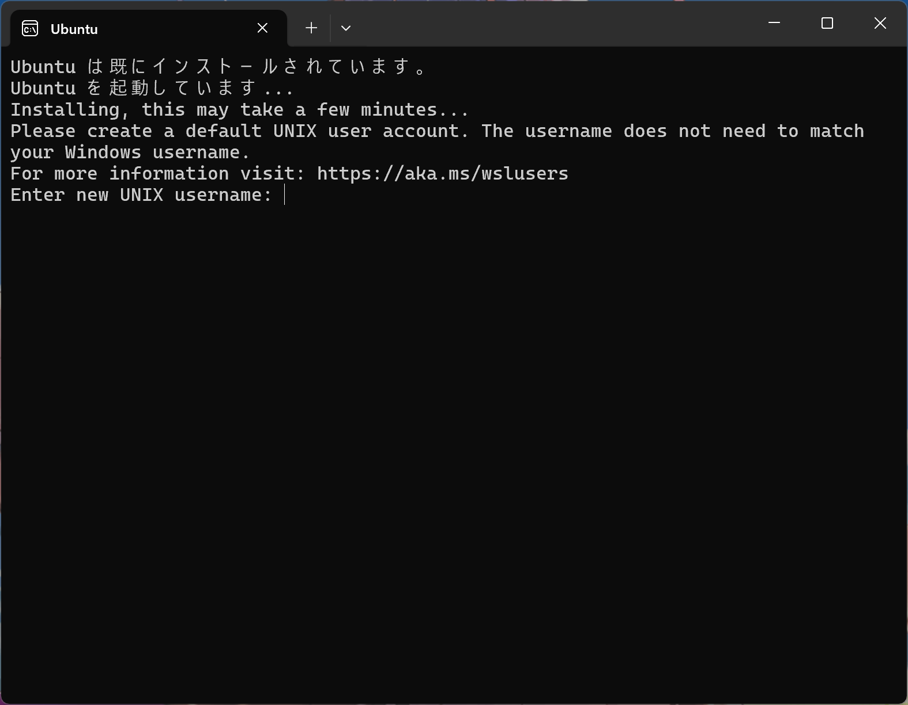
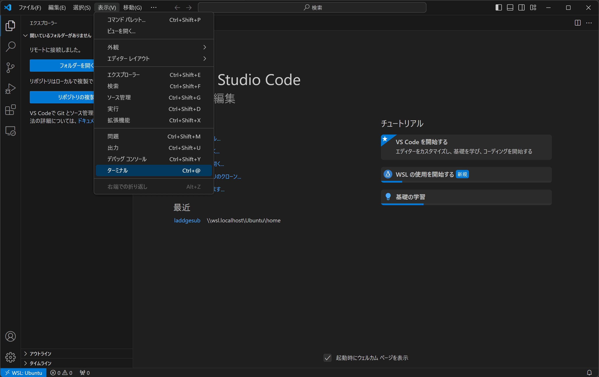

この記事は3つの記事の1つ目です。
- ①準備編 (now)
- [②実践編](/blog/make_your_site_2)
- [③応用編](/blog/make_your_site_3)

## はじめに
春から大学生のみなさん、進学おめでとうございます。
僕も春から電気通信大学で勉強します。

この一連の記事は、これからプログラミングを勉強してみたいと思っている人を対象に、自分のホームページを作ることを通して、自分でコードを書いてモノを作ることの楽しさを知ってもらうことを目的としています。

②の実践編までついてきてもらえれば、未経験でも自分のサイトを持つことができるはずです。

最終的には、下のようなサイトを作れるようになります。

https://uectaro.laddge.net

## 環境構築
まずは、開発環境を整えます。

今回は、Windows (10以降) を想定して進めます。

Mac等、その他の環境については、説明を割愛します。もし分からないことがあれば、TwitterやDiscordで気軽に聞いてください。

### VSCodeのインストール
まずは、エディターを用意します。

プログラムを書くときはテキストファイルに色々書いていくわけですが、ちゃんとしたエディターだと、コードの候補を表示したり(補完といいます)、間違いを見つけてくれたりするので、特別な理由がなければ専用のエディターをインストールすることをおすすめします。

今回インストールするVSCodeというエディターは、Microsoft社製のソフトウェアで、無料で利用できます。

使っている人が多く、ネット上でもたくさん情報が見つかります。

大学のプログラミングの勉強でも使えるはずなので、ぜひこの機会にセットアップしてしまいましょう。

まずは、インストーラーを以下のサイトからダウンロードします。

https://code.visualstudio.com/download


左のWindowsと書かれた青いボタンからダウンロードできます。

この記事を書いたときはバージョン1.87.1でした。

ダウンロードしたインストーラーを起動し、VSCodeをインストールしてください。

**途中で、追加タスクの選択という画面がありますが、そこは全てにチェックを入れておくといいと思います。**

インストールが完了して、VSCodeを起動すると、以下のような画面になっていると思います。


VSCodeの言語を日本語に変更するために、拡張機能を追加します。

まずは、上の画像の赤枠のボタンを押してください。


左上の検索窓に「japanese」と入力すると、「Japanese Language Pack for VS Code」という拡張機能が出てくるので、これをインストールします。


VSCodeを再起動しろというポップアップが出るので赤枠のボタンを押して再起動します。


無事日本語になりましたか？

ここまでできたら、とりあえずVSCodeのインストールは完了です。

### gitのインストール
次に、gitというソフトウェアをインストールします。

その前に、gitとは何か説明します。

プログラムを書くときに、今までどのような変更をしてきたかを知れたり、以前の状態に戻せたりすると便利ですよね。

これを実現する仕組みを**バージョン管理**といい、バージョン管理を行うためのソフトウェアの一つがgitです。

みなさんが普段使っているアプリにもバージョンという概念がありますよね。あれがまさにバージョン管理です。

gitに似た名前で[GitHub](https://github.com)というものを聞いたことがあるかもしれません。

GitHubは、gitで管理しているファイル群(リポジトリといいます)を、オンラインのサーバーに保存しておけるサービスです。

僕が書いたプログラムはほとんどGitHubにあげてあります。

https://github.com/laddge

実際にgit管理しているこのブログの更新履歴は下のような感じです。


GitHubについては後ほどまた詳しく説明します。

それでは、早速gitをインストールていきましょう。

まずは、以下のサイトからインストーラーをダウンロードしてください。

https://git-scm.com/download/win


赤枠で囲ったところを押してダウンロードします。

この記事を書いたときはバージョン2.44.0でした。

インストーラーを開くと、「このアプリがデバイスに変更を加えることを許可しますか？」と出るかもしれませんが、もちろん「はい」を押して進めてください。


途中で、gitで使用するエディターを選ぶ場面がありすが、ここは先ほどインストールしたVSCodeを選ぶといいでしょう。

他は全部そのままNextを押していけば大丈夫です。

インストールが完了したら、VSCodeを再起動してみてください。

左側の「フォルダーを開く」というボタンの下に、「リポジトリの複製」というボタンが現れているはずです。

### GitHubアカウントの作成
次に、GitHubのアカントを作成します。

GitHubは、gitで管理しているリポジトリをリモートに保存しておくところです。

GitHubにあげておくと、他の人とコードを共有したり、バグ報告などの議論を行えたります。

例えば、僕のこのサイトのソースコードは以下の場所に置いてあります。

https://github.com/laddge/mysite

それ以外にも色々機能がありますが、今回は割愛します。

興味がある人は色々調べてみてください。

まずは、以下のサイトに行き、アカウントを作ります。

https://github.com/signup

メールアドレスやユーザー名、パスワードなどを入力して進むだけです。

英語ですが、そんなに難しい内容ではないので、すんなりアカウントを作成できると思います。

最初なので、なんか色々聞かれるかもしれませんが、skipできるところはskipしちゃっていいです。

アカウントが作成できたら、次に、VSCodeでGitHubと連携します。

VSCodeで拡張機能の画面を開き、「GitHub」と検索します。


インストールすると、左の人アイコンのところにバッジが付くので、それを押してください。


赤枠のところを押して、GitHubでログインします。

ログインしてからVSCodeに戻ると、上の画像の「どのアカウントでもサインインしていません」のところが自分のアカウント名になっているはずです。

### WSLのセットアップ
さて、ここで少し難しいことをします。

この次に導入するbun.jsというものが、Windowsに対応していないため、LinuxというタイプのOSを仮想環境で動かす必要があります。

とはいえ、手順に従ってやれば簡単に導入できます。

まず、Windowsのスタートアイコン(窓のやつ)を**右クリック**して、「ターミナル (管理者)」というメニューをクリックします。

環境によっては、ターミナルではなくPowerShellと表記されているかもしれません。

そうしたら、出てきたいかにもな黒い画面に、以下のコマンドを入力します。

```bash
wsl --install
```

上の文字列を入力してエンターキーを叩くと、WSLのインストールが始まります。

確認のダイアログが出たら「はい」を押してください。

しばらく待つと、UbuntuというOSが仮想環境にインストールされます。

「システムを再起動する必要があります。」と出るので、パソコンを再起動してください。(保存してないファイルの保存を忘れずに！)

再起動すると、以下のような画面が出ます。



ユーザーネーム(英字小文字)とパスワードを決めて入力してください。

パスワードは画面に表示されませんが、ちゃんと入力されているので、そのまま進んでください。


次に、以下のコマンドをこの画面に入力してください。

```bash
sudo apt update
sudo apt upgrade -y
```

パスワードを求められたら、さっき決めたパスワードを入力してください。

ここまでできたら、WSLのインストールは完了です。ターミナルを閉じてください。

次に、VSCodeでWSLの環境を使えるようにします。

VSCodeを起動し、一番左下の青いボタンを押してください。


そうすると、画面上のほうにメニューが出てくるので、「WSLへの接続」というところを押してください。

これで、WSL上のファイルをVSCodeで編集できるようになります。

この状態で、もう一度拡張機能の画面に行き、「GitHub Pull Requests」という拡張機能をWSL環境にもインストールする必要があります。

### bun.jsのインストール
長くなりましたが、準備編はこれで最後です。

僕が作った今回のプロジェクトは、サイトを生成するのに、bun.jsというツールを使っています。

https://bun.sh

これをWSLの環境にインストールします。

まずは、以下の画像に示したメニューから、ターミナルを開きます。



画面右下にターミナルが出現するので、そこに以下のコマンドを入力してください。

```bash
sudo apt install -y unzip
curl -fsSL https://bun.sh/install | bash
```

完了したら、ターミナルの右上のごみ箱のボタンを押して、ターミナルを強制終了し、もう一度ターミナルを開いてください。

```bash
bun --version
```

と入力し、bun.jsのバージョンが確認できれば、インストールは完了です。

この記事を書いたときはバージョン1.0.30でした。

## 次のステップに進む
おつかれさまでした。

準備編は以上になります。

実践編では、いよいよ自分のホームページを作っていきます。

[&gt;&gt;実践編へ](/blog/make_your_site_2)
