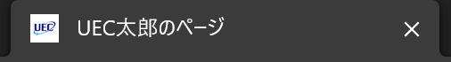

この記事は3つの記事の2つ目です。
- [①準備編](./make_your_site_1)
- ②実践編 (now)
- [③応用編](./make_your_site_3)

## 実践編について
①の準備編では、開発環境を整えました。

実践編では、実際に自分のホームページを作って公開するところまで行きます。

## プロジェクトをフォークする
まずは、僕が作ったプロジェクトをフォーク(リポジトリを引き継ぐこと)してもらいます。

以下のリンクを開いてください。

https://github.com/laddge/makeYourSite


赤枠のボタンを押して、リポジトリをフォークします。


**Repository nameは`{GitHubのid}.github.io`にしてください。(ここ大事)**

Create forkを押すと、少し待たされたあと、自分のGitHubにリポジトリが引き継がれます。

## リポジトリのクローン
次に、VSCodeに先ほどのリポジトリをクローンします。


左下の表示でWSL環境になっていることを確認し、赤枠のボタンを押します。

入力欄の真下に、「GitHubから複製」というところがあるので、これを押します。

すると、先ほどフォークしたリポジトリが候補に出るので、これを押します。

「フォルダーを選択してください」と出ますが、そのままOKしてください。

「クローンしたリポジトリを開きますか？」と出るので、「開く
」を押してください。


画像のような確認画面が出たら、「信頼する」のほうを押してください。

ここまでで、リポジトリのクローンができました。

ついでに、右下におすすめの拡張機能のサジェストが出ているので、これもインストールしておきましょう。


## 開発サーバーを起動
次に、開発サーバーを起動します。

ターミナルを開き、以下のコマンドを入力します。

```bash
bun install
bunx astro preferences disable devToolbar
bun run dev
```

開発サーバーが起動すると、以下の画像のように、localhostなURLが表示されます。


画像では、`http://localhost:4321`となっていますが、環境によって後ろの番号は違うかもしれません。

このURLをブラウザで開いてみてください。


この開発サーバーを立ち上げておくと、このあとファイルを編集したときにリアルタイムに更新されます。

なので、ここからは、ブラウザとVSCodeを両方見える状態で開発するといいと思います。

## 内容を編集
ここからは、UEC太郎のプロフィールを、みなさん自身のものに変えていきます。

細かいカスタマイズは応用編でやるとして、実践編では、最低限の変更だけしていきます。

### ヘッダーの編集
まずは、ヘッダー部分の「UEC太郎のページ」となっているところを編集します。

VSCodeの左のファイルツリーから、`src` =&gt; `components` という順にディレクトリを開くと、`Header.astro`というファイルがあるので、これを編集します。

16行目に以下のような記述があります。

```html
<a href="/" class="top-link">UEC太郎のページ</a>
```

これは、HTMLというWebサイトの構造を定義する言語で書かれていて、`<a ~ >`という部分をタグといいます。

`<a>`と`</a>`で囲まれた部分がその中身で、`href="/"`や`class="top-link"`は属性といいます。

つまり、上のコードでは、「aという種類のタグで、href属性の値は"/"で、class属性の値は"top-link"で、タグの中身は"UEC太郎のページ"ですよ」という意味です。

タグの種類はもっといっぱいあって、それぞれに意味もあるのですが、今回は割愛します。

まずはサイトを完成させて、後で少しずつ自分の好みに合わせていくと、その過程で色々な情報を得られると思います。

話を戻します。

まずはこの、「UEC太郎のページ」となっているところを、自分のサイトのタイトルに書き換え、Ctrl+sで上書き保存してみましょう。

そうすると、一瞬でブラウザのほうの画面に反映されるはずです。

こうやってどんどん書き換えていきます。

### フッターの編集
同様にして、ページの一番下の「&copy; 2024 UEC太郎」となっているところを書き換えます。

`Header.astro`と同じ階層に、`Footer.astro`というファイルがあるので、それを開いてください。

5行目に、以下のような記述があります。

```html
<small>&copy; 2024 UEC太郎</small>
```

これを先ほどと同じ要領で書き換えます。

ちなみに、このフッターの表記は、コピーライトといって、その人の著作物であることを明示する目的で設置します。

なので、自分の名前(ネットでの名前でいい)を書くようにします。

本当は無くても問題ないことが多いですが、僕はだいたいのサイトに書いています。

保存したら、ブラウザのほうに反映されているか確認してください。

### ページ本文の編集
次は、いよいよ本文の編集をしていきます。

今回のサイトには、3つのページがあって、それぞれ以下のようにファイルと対応しています。

```
./src/pages/
├── index.astro     = ホーム
├── about.astro     = 自己紹介
└── social.astro    = SNS
```

それぞれのファイルに共通することとして、以下のような記述があります。

```html
<Layout title="UEC太郎のページ" description="とある大学生のプロフィール">
```

ここの、title属性とdescription属性は、それぞれページのタイトルと説明を表わしています。

title属性をいじると、ブラウザのタブのタイトルが変わるはずです。

また、description属性は、Discordなどでシェアしたときにタイトルの下に表示されます。

ページの内容については、基本的に元々書いてあるやつをコピペしたりしながら、自分の情報を書いていってください。

また、トップページの画像(UECの画像になっているところ)は、VSCodeの左のファイルツリーから、`src` =&gt; `assets` という順にディレクトリを開くと、`profile.png`というファイルがあるので、これを自分の画像に差し換えます。

ファイルツリーで右クリックすると、「エクスプローラーで表示する」というのがあるので、それをクリックするとファイルの場所を表示できます。

### faviconを設定する
次に、faviconというものを設定します。

faviconという名前は聞き慣れないかもしれませんが、多分みなさんいつも目にしているものだと思います。



こういうブラウザのタブに表示される画像のことです。

スマホでホーム画面にブックマークを追加したときなどにも使われます。

この画像はいくつかのサイズを用意する必要がありますが、それを一括で生成してくれるサイトがあります。

https://ao-system.net/favicongenerator/

このサイトでfaviconにしたい画像を読み込むと、色々なサイズのfaviconを生成してくれます。

生成したら、「ファビコンダウンロード」というボタンを押して、zipファイルをダウンロードします。

zipファイルの中から以下のファイルを取り出し、`public`ディレクトリの中身を差し換えます。

- favicon.ico
- apple-touch-icon-180x180.png
- icon-192x192.png

### その他の設定
最後に、`./src/layouts/Layout.astro`を少しいじります。

20, 21行目に以下のような記述があります。

```js
const siteName = 'UEC太郎のページ'
const url = 'https://uectaro.laddge.net'
```

これを自分のサイトに合わせて編集してください。

urlのほうは、`https://{GitHubのid}.github.io`となります。(例: `https://laddge.github.io`)

## サイトを公開する
ここまでの変更で、自分のサイトのソースコードは完成しました。

これをいよいよ、インターネット上に公開していきます。

### ステージング、そしてコミット
git管理しているリポジトリで変更に区切りをつけるために、コミットという操作を行います。

それまでの変更を1つのコミットという単位で区切る感じです。

そして、コミットに含める変更点を選んで追加する操作を、ステージングといいます。

流れとしては以下のようになります。

1. ファイルに変更を加える
2. 変更したファイルをステージング
3. ステージングした変更をコミット

基本1 =&gt; 2 =&gt; 3の順で行いますが、2のあとに1に戻ってまた2のようになってもいいです。

コミットするときは、ステージングされた変更のみがコミットされる仕様になっています。

VSCodeでは、左のサイドバーからソース管理を開くと、変更したファイルの一覧が表示されます。

ファイル名のところにマウスカーソルをのせると、「＋」のアイコンが表示されるので、これを押すとそのファイルがステージングされます。

また、変更と書かれたところにマウスカーソルをのせると、変更があった全てのファイルをステージングするボタンが表示されます。

今回は、全てのファイルをステージングしてください。

そうしたら、次にコミットをします。

**が、その前に、追加の設定が必要です。**

ターミナルに以下のコマンドを入力してください。

```bash
git config --global user.name "GitHubアカウントの名前"
git config --global user.email "GitHubアカウントのメールアドレス"
```

(もちろん、""の中は自分のGitHubアカウントの情報を入れてくださいね)

開発サーバーが動いている場合は、Ctrl+cで止めることができます。

ここまでできたら、コミットします。

一番上のメッセージを入力する欄に、コミットの説明(コミットメッセージといいます)を書いて、コミットボタンを押してください。

### pushする
コミットできたら、GitHubに変更を同期します。

コミットボタンが「変更の同期」というボタンに変わっていると思うので、これを押します。

### GitHub pagesに公開する
pushできたら、ブラウザでリポジトリのページを開きます。

上のタブから、「Settings」という画面を開き、メニューから「Pages」という画面を開きます。


赤枠のところから、「GitHub Actions」を選択します。

次に、上のタブから、「Actions」の画面に行き、「Deploy to GitHub Pages」を選択し、「Run workflows」を押します。


この操作は、次回からはGitHubにpushしたタイミングで自動的に実行されます。

しばらく待って、緑のチェックマークが表示されたら完了です。

`https://{GitHubのid}.github.io`を開くと、自分のサイトが公開されているはずです！

## 次のステップに進む
ここまでで、自分のサイトを公開するという目的は達成されました。

でも、今のままだと、これを読んでいる人たちがみんな同じようなサイトになってしまいますよね。

ということで、応用編では、サイトをもっとカスタマイズする方法を紹介します。

[&gt;&gt;応用編へ](./make_your_site_3)
