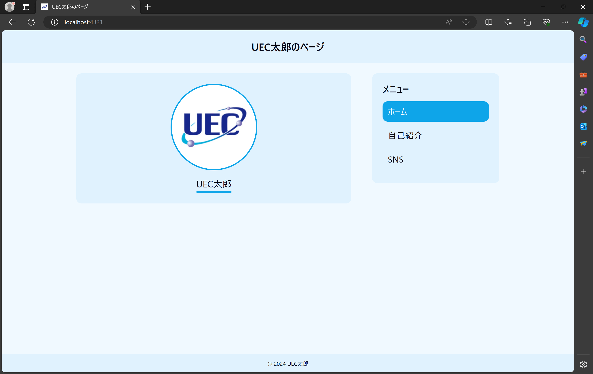

この記事は3つの記事の3つ目です。
- [①準備編](./make_your_site_1)
- [②実践編](./make_your_site_2)
- ③応用編 (now)

## 応用編について
②の実践編では、ついにサイトを公開するところまでいきました。

応用編では、より"自分のサイト"にするために、いくつかカスタマイズのやりかたを紹介します。

## 色などのスタイルを変更
まずは見た目のカスタマイズをしていきましょう。

もともと以下のような見た目ですが、



以下のように見た目を変えることができます。


テーマカラーと角の丸みを変更できる設計になっています。

変更する箇所は、`./src/global.css`にあります。


```css
:root {
  --color-bg-1: #f0f9ff;
  --color-bg-2: #e0f2fe;
  --color-bg-3: #bae6fd;
  --color-text: #020617;
  --color-accent: #0ea5e9;
  --color-on-accent: #f0f9ff;
  --color-link: #0284c7;
  --corner-radius: 0.75rem;
}
```

上から、

- 背景色
- カードの背景色
- メニューをホバーしたときの背景色
- テキストの色
- アクセントカラー(選択されたメニューなど)
- アクセントカラーの要素のテキスト色
- リンクのテキスト色
- 角の丸み

に対応しています。

### テーマカラーの変更
色はカラーコードで指定します。(他の指定方法もありますが、ここでは説明しません。)

カラーコードは、`(r, g, b) = (1, 0, 0) ~ (255, 255, 255)`の色を16進法でRGBの色ごとに表わしたのを結合して6桁にしたものです。

例えば、完全な白(200色あると困るのでこう表現しています)は、RGBの三つの値がどれも255なので、`#ffffff`となります。

同様に、黒は`#000000`、青は`#0000ff`となります。

ちなみに、Laddgeのアイコンの背景色は`#28a3cc`です。([ソース](https://github.com/laddge/laddge-icon))

話を戻して、サイトのテーマカラーを選びましょう。

とはいえ、いきなりイメージどおりの色をカラーコードで表わせる人はそういません。

というか一般人には無理です。

そこで、いい感じの色を拾ってきます。

僕はよく以下のサイトを参考にします。

https://tailwindcss.com/docs/customizing-colors

https://www.materialpalette.com/colors

開発サーバーを立てて、リアルタイムにプレビューしながら調整するといいでしょう。

### 角の丸みの調整
角の丸みについては、remという単位になっていますが、これは、ブラウザのデフォルトのフォントサイズのテキストの縦幅を1remとした相対的な単位です。

シンプルに、値が大きくなれば丸っこくなり、小さくなれば角ばった感じになります。

これも開発サーバーを活用して確認しながら調整するといいでしょう。

## ページの追加
今はページは三つだけですが、増やすことももちろんできます。

`./src/pages`内のファイルを増やせば、それに応じてページも増えます。

今あるページをコピーして作れば簡単だと思います。

ただ、`./src/pages`にページを追加するだけでは、メニューに追加されません。

メニューの編集のしかたを説明します。


`./src/layouts/Layout.astro`の22~26行目の記述が該当します。

見たまんまなのでわかると思います。(説明放棄してますね)

既にあるメニューを参考に、メニューのアイテムを編集してください。

## おわりに
カスタマイズが完了したら、実践編とおなじ手順でステージング、コミット、プッシュを行なってください。

プッシュされた時に、GitHub側で自動的に処理が走って公開されるようになっています。

僕が用意した簡単なカスタマイズの手段は以上ですが、やろうと思えばもっと高度なこともできます。

もっと知りたい人は、今回僕が使用しているフレームワークはAstroというものなので、そのドキュメントを読んでみるのもいいと思います。

https://docs.astro.build/ja/getting-started/

また、「こういう機能をつけたいんだけどどうしたらいい？」というような質問は、気軽にTwitterやDiscordで声をかけてもらえれば、できる範囲で対応します。お気軽にどうぞ。

さいごに、今回はプログラミング初心者向けとはいえ、あまりコードを書く場面はなかったですが、自分でものを作る楽しさを分ってもらえたら嬉しいです。

これからもっと高度なことをする機会があるかもしれませんが、一緒に楽しんでいきましょう！
