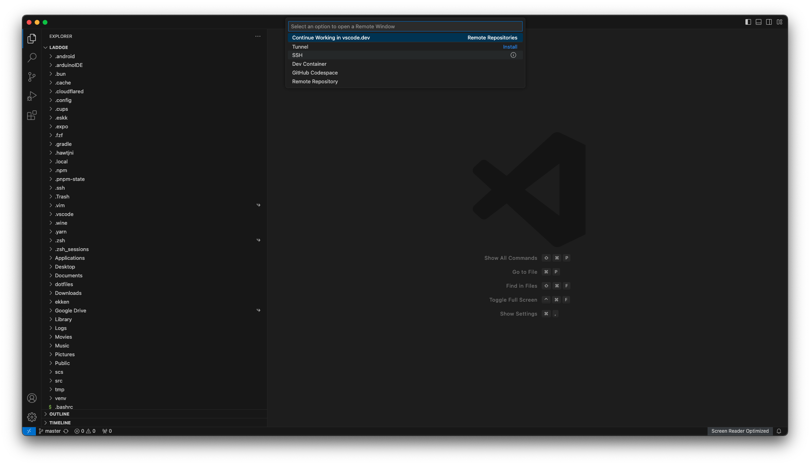
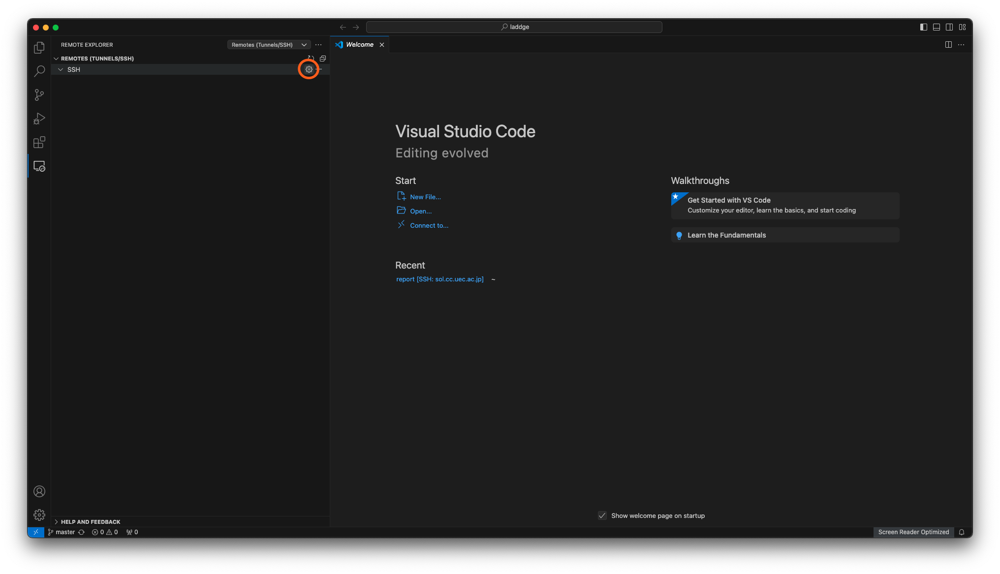
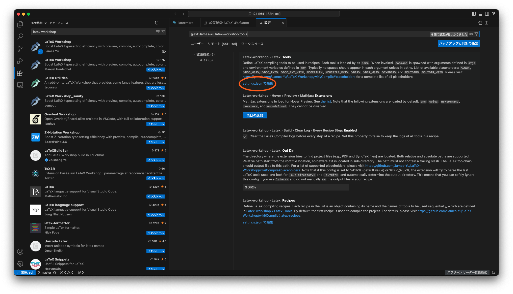

関係なさすぎるサムネですね。

## やりたいこと
こんにちは、電気通信大学 情報理工学域 Ｉ類 1年のらっじです。

電通大では、1年の必修科目の基礎科学実験A(通称：謁見)やコンピューターリテラシー(通称：コンリテ)などにおいて、$\LaTeX$でレポートを書く場面が出てきます。

特にコンリテでは、$\LaTeX$で書いたレポートをsolと呼ばれる学内のLinux環境でコンパイルしなさいという指示があります。

しかもなぜか、~まったく理解できないけど~emacsを使って書けと言われます。

まあ、sshするのでターミナルで書ける必要があるからですかね。

これに結構困惑してるひとが多く、(まあそりゃいきなりemacsに慣れろなんて無理な話ですよ)、クラウド$\LaTeX$で書いたりなど工夫してる人もいるわけですが、もっとスマートな方法があると思ったのでそれを紹介します。

今回の記事は思いっきり電通大生向けの記事になります。

## VSCodeを使いましょう
とりあえず、emacsが諸悪の根源なので、VSCodeを使いましょう。

VSCodeは、ssh先のファイルをローカル(手元のPCのことだよ)にあるファイルと同じように扱えます。

まずは、VSCodeをインストールしましょう。
やり方は↓以前の記事↓に書いてあるのでそっちを見てみてください(特大サボり)。

https://laddge.net/blog/make_your_site_1

## sshの設定
さて、VSCodeでsshする前に、sshをちょっと便利にする設定を紹介します。

### 公開鍵認証
多分みなさんsshするときに毎回パスワードを入力してると思うんですが、それをパスワード認証でなくて公開鍵認証という方式にすることで、毎度パスワードを打つ手間をなくすことができます。

細かいことはあえて説明しませんが、パスワードの代わりになる鍵を手元のPCで生成して、それをsolに登録することで認証するという方式です。

まずは、以下のコマンドを実行してください。

```bash
ssh-keygen -t rsa -b 4096
```

**パスワードを設定するか？みたいなことを聞かれますが、全部無視してエンター連打でいいです。**

このコマンドで、ssh用に秘密鍵&公開鍵のキーペアが生成されます。

ペアとなっている二つのキーの片方を渡して、片方の鍵で暗号化したデータをもう片方の鍵で複合化する仕組みですね。

ペアで動作するので、公開鍵のほうを公開してもデータを盗み見られる心配がない、という感じです。

鍵認証の細かい仕組みはとりあえず置いといて先進みます。

次に、公開鍵をsolに登録します。
以下のコマンドを実行してください。

```bash
scp ~/.ssh/id_rsa.pub {solのユーザー名}@sol.cc.uec.ac.jp:~/.ssh/authorized_keys
```

sshするときと同じようにパスワードを聞かれるので、入力してログインしてください。

ここまでできたら、とりあえず公開鍵認証の設定は完了です。

sshしてみてください。
パスワードを聞かれなくなったと思います。

### configファイルの作成
更に、`{solのユーザー名}@sol.cc.uec.ac.jp`と入力するのもめんどいので、省略する方法を紹介します。

VSCodeを開いて、一番左下の青いボタンを押してください。

上の方に入力欄が出てくるので、その下のSSHというメニューを押してください。



そうすると、必要な拡張機能がインストールされます。

一番左のアイコンが縦に並んでいるところの一番下に、「Remote Explorer」というのが追加されたので、それを開きます。



上の画像の丸をした設定アイコンをクリックすると、メニューが出るので、一番上のやつを選んでください。(`{ホームディレクトリ}/.ssh/config`となっているやつ)

そのファイルに以下の内容を入力して保存してください。

```bash
Host sol
    HostName sol.cc.uec.ac.jp
    User {solのユーザー名}
    Port 22
    IdentityFile ~/.ssh/id_rsa
    ServerAliveInterval 60
```

これで次からは、`ssh sol`のように入力するだけでsshできるようになります。

IdentityFileには、先程生成した秘密鍵のほうを指定しています。

VSCodeの左下の青いボタンを、もう一度押して、「Connect to Host... Remote-SSH」というオプションがあると思うので、それを押して、「sol」と入力すると、solのファイルをいじれるようになります！！

左下の青いボタンに「SSH: sol」と表示されるようになったと思います。

## $\LaTeX$の設定
次はいよいよ、$\LaTeX$のファイルを編集するのに必要な設定をしていきます。

なお、ここらへんはもともと詳しくないので以下のサイトを参考にしました。

https://www2.yukawa.kyoto-u.ac.jp/~koudai.sugimoto/dokuwiki/doku.php?id=latex:vscode%E3%81%AB%E3%82%88%E3%82%8Blatex%E7%92%B0%E5%A2%83%E3%81%AE%E5%9F%BA%E6%9C%AC%E8%A8%AD%E5%AE%9A

### latexmkの設定
まずは、latexmkというものの設定をします。

:::info
**これはなに？**  
コンリテの資料では、platexでコンパイル→dvipdfmxでPDF化という手順を踏むように解説されていますが、latexmkを使うと、コマンド一発でPDF化までしてくれるようになります。
:::

まずは、solに繋がったVSCodeで一番左上のアイコンからエクスプローラーを開き、「フォルダーを開く」を押します。

ディレクトリを選ぶ画面が出ますが、そのまま「OK」を押してください。(ホームディレクトリが開かれます。)

そこで新しく、「.latexmkrc」というファイルを作成し、以下の内容で保存してください。

```perl
#!/usr/bin/env perl
 
$latex = 'platex %O %S';
$bibtex = 'pbibtex %O %S';
$biber = 'biber --bblencoding=utf8 -u -U --output_safechars %O %S';
$makeindex = 'mendex %O -o %D %S';
$dvipdf = 'dvipdfmx %O -o %D %S';
```

全行をコピペしてください。

~めんどいので~内容の解説は割愛します。
調べれば色々情報出てくると思うので、興味があればぜひ。

### LaTeX Workshopを導入
次に、VSCodeに$\LaTeX$の拡張機能を入れます。

VSCodeの左のアイコンが縦に並んでいるところに、拡張機能というボタンがあるので、それを開きます。

検索窓に「LaTeX Workshop」と入力して、一番上に出てきたものをインストールしてください。

次に、拡張機能の設定をします。

インストールボタンの横に設定アイコンがあるので、それを押して、「拡張機能の設定」を開いてください。

出てきた画面の検索窓に、「tools」と追記して、以下のスクショの「settings.jsonで編集」をクリックしてください。



開かれた設定ファイルの、`-pdf`を`-pdfdvi`に書き換えて保存してください。

Before:

```json
...
{
    "name": "latexmk",
    "command": "latexmk",
    "args": [
        "-synctex=1",
    "-interaction=nonstopmode",
    "-file-line-error",
    "-pdf",  // ここを編集
    "-outdir=%OUTDIR%",
    "%DOC%"
    ],
    "env": {}
},
...
```

After:

```json
...
{
    "name": "latexmk",
    "command": "latexmk",
    "args": [
        "-synctex=1",
    "-interaction=nonstopmode",
    "-file-line-error",
    "-pdfdvi",
    "-outdir=%OUTDIR%",
    "%DOC%"
    ],
    "env": {}
},
...
```

ここまでできたら、設定は完了です！！

## コンパイル
いよいよ、コンパイルしてみます。

適当に新しいディレクトリを作り、上のメニューバーから「ファイル」→「フォルダーを開く」でそのディレクトリを開いてください。

さらに、メニューバーから「ターミナル」→「新しいターミナル」でターミナルを開きます。

以下のコマンドでサンプルファイルを持ってきてください。

```bash
cp /class/jb/CLIT/activity09.tex .
```

エクスプローラーにファイルが追加されていると思うので、それを開きます。


右上に上のようなボタンがあるので、三角のボタンを押すとコンパイルできます。

一度コンパイルをした上で、その隣のボタンを押すと右画面にPDFが表示されます。

次からは、左画面で$\LaTeX$のファイルを編集して保存する度に、右画面のPDFが自動的に更新されます！！

## さいごに
以上の方法が多分、もっともスマートなレポートを書く環境だと思います。

慣れなくて大変なこともあると思いますが、慣れれば楽しめるかもなので一緒に頑張りましょう！

わからないことなどあれば、TwitterのDMなどで気軽に聞いてください。
