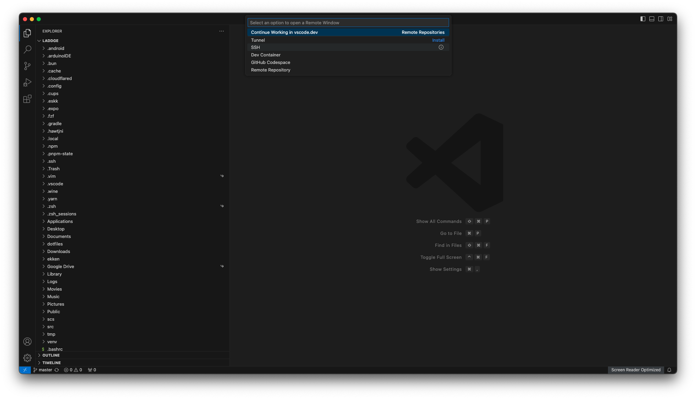
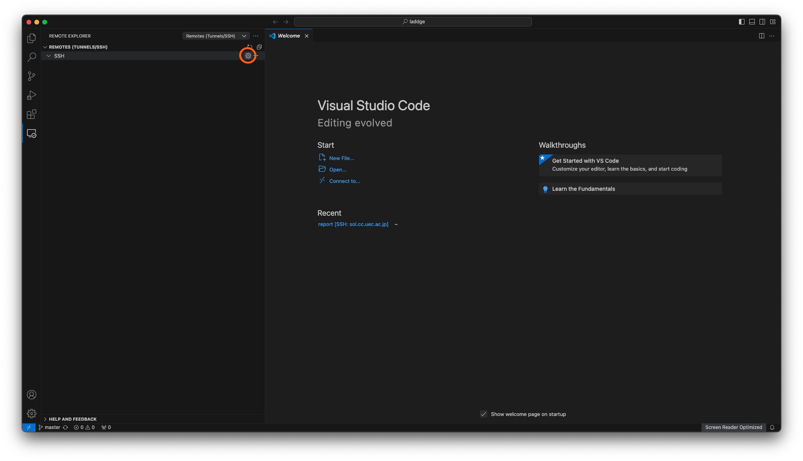

## やりたいこと
おはようございます、電気通信大学 情報理工学域 Ｉ類 1年のらっじです。

電通大では後学期が始まり、1年生は「基礎プログラミングおよび演習(通称: 基礎プロ)」という科目が生えて、前学期よりも本格的にプログラムを書く演習をするようになります。

基礎プロでは、学内のsolというコンピューターを用いて演習を行ないますが、うまくやると学外からも自分のパソコンで遠隔操作ができるようになります。

今回は、そのためのおすすめの方法について書きます。
ちなみに似たような内容を以前の記事でも書いていて、重複する部分もありますが気にしないでください。

:::info
前の記事を読んでやってみてくれた方も、多少内容が変わっているので、この記事の設定を全部やることをおすすめします
:::

## VSCodeを使いましょう
とりあえず、emacsの操作を(実用レベルで)習得するのは大変だし、VSCodeというものを使えば色々便利になるので、とくに理由がなければVSCodeを使いましょう。

VSCodeでは、sshという方法を用いてsolのファイルをローカル(手元のPC)にあるファイルと同じように扱えます。

まずは、VSCodeをインストールしましょう。
やり方が分からない場合は、↓以前の記事↓に書いてあるのでそっちを見てみてください。

https://laddge.net/blog/make_your_site_1/#vscode%E3%81%AE%E3%82%A4%E3%83%B3%E3%82%B9%E3%83%88%E3%83%BC%E3%83%AB

## sshの設定
まずはsshの設定ファイルを作ります。

VSCodeを起動したら、メニューバー(画面一番上のやつ)から「ターミナル」-> 「新しいターミナル」を開いて、このあとのコマンドはそこに入力するようにしてください。

### 公開鍵認証
何も設定していないと、sshをするときにパスワードの入力を求められますが、それをパスワード認証でなくて公開鍵認証という方式にすることでその手間をなくすことができます。

細かいことはあえて説明しませんが、パスワードの代わりになる鍵を手元のPCで生成して、それをsolに登録することで認証するという方式です。

まずは、以下のコマンドを実行してください。

```bash
ssh-keygen -t ed25519
```

**パスワードを設定するか？みたいなことを聞かれますが、全部無視してエンター連打でいいです。**

このコマンドで、ssh用に秘密鍵&公開鍵のキーペアが生成されます。

ペアとなっている二つのキーの片方を渡して、片方の鍵で暗号化したデータをもう片方の鍵で複合化する仕組みですね。

ペアで動作するので、公開鍵のほうを公開してもデータを盗み見られる心配がない、という感じです。

鍵認証の細かい仕組みはとりあえず置いといて先進みます。

次に、公開鍵をsolに登録します。
以下のコマンドを実行してください。

```bash
# Windowsの場合
cat ~/.ssh/id_ed25519.pub | ssh {solのユーザー名}@sol.cc.uec.ac.jp "mkdir -p ~/.ssh && chmod 700 ~/.ssh && cat >> ~/.ssh/authorized_keys && chmod 600 ~/.ssh/authorized_keys"

# Mac or Linuxの場合
ssh-copy-id -i ~/.ssh/id_ed25519.pub {solのユーザー名}@sol.cc.uec.ac.jp
```

`{solのユーザー名}`のところを各自置き換えてください。

sshするときと同じようにパスワードを聞かれるので、入力してログインしてください。

:::info
初めてsshする場合は、`Are you sure you want to continue connecting (yes/no/[fingerprint])?`と聞かれますが、これには"yes"と答えてエンターを押してください。
:::

ここまでできたら、公開鍵認証の設定は完了です。

### configファイルの作成
次に、sshのconfigファイルを書きます。

VSCodeを開いて、一番左下の青いボタンを押してください。

上の方に入力欄が出てくるので、その下のSSHというメニューを押してください。



そうすると、必要な拡張機能がインストールされます。

一番左のアイコンが縦に並んでいるところの一番下に、「Remote Explorer」というのが追加されたので、それを開きます。



上の画像の丸をした設定アイコンをクリックすると、メニューが出るので、一番上のやつを選んでください。(`{ホームディレクトリ}/.ssh/config`となっているやつ)

そのファイルに以下の内容を入力して保存してください。

```bash
Host sol
    HostName sol.cc.uec.ac.jp
    User {solのユーザー名}
    Port 22
    IdentityFile ~/.ssh/id_ed25519
    ServerAliveInterval 60
```

IdentityFileには、先程生成した秘密鍵のほうを指定しています。

VSCodeの左下の青いボタンを、もう一度押して、「Connect to Host... Remote-SSH」というオプションがあると思うので、それを押して、「sol」と入力すると、solのファイルをいじれるようになります！！

左下の青いボタンに「SSH: sol」と表示されるようになったと思います。

あとは、フォルダを開くなどして演習のファイルを編集できます。

また、`irb`コマンドなどを実行したい場合も、最初にやったようにメニューバー(画面一番上のやつ)から「ターミナル」-> 「新しいターミナル」を開くとそこで実行できます。

## 拡張機能をインストール
ここまででも十分便利になりますが、よりVSCodeの魅力を引き出すために、拡張機能をインストールしましょう。

今回は、VSCode上でrubyのコードを書くときに、入力の候補を出したり、間違った構文を満つけてくれたりする拡張機能を入れます。


### rubyのバージョンを変更
まず、solにインストールされているrubyはバージョンが古く、サポートが切れているため、新しいバージョンのrubyをインストールします。

solだと管理者権限が使えない関係で、通常の方法ではインストールできないので、少し遠回りな方法でインストールする必要があります。

今回は、一連の流れを1回で実行できるようにスクリプトを作成しました。
以下のコマンドを**solに繋いだVSCodeのターミナルから**実行すれば大丈夫です。

```bash
curl -fsSL https://gist.githubusercontent.com/laddge/f99e4ed173abe3e14c14d965751d54e1/raw/4aa232ce7f4d9c2aecc6e1662212d7f15d30881f/install.sh | bash
```

少し時間がかかるかもしれませんが気にしないでください。

コマンドが終了したら、`exit`コマンドで一度ターミナルを閉じ、もう一度「新しいターミナル」からターミナルを開いてください。

以下のコマンドを実行するとrubyのバージョンを確認できます。

```bash
ruby --version
```

自分の環境では`ruby 3.3.5 (2024-09-03 revision ef084cc8f4) [x86_64-linux]`と出力されました。

### solargraphの導入

VSCodeのターミナルで以下のコマンドを実行してください。

```bash
gem install solargraph
echo -e 'AllCops:\n  DisabledByDefault: true' > ~/.rubocop.yml
```

次に、VSCode側で拡張機能を入れます。


↑まずは左のバーから拡張機能のタブを開いて「solargraph」と検索欄に入力し、この拡張機能をインストール


↑次に拡張機能の設定を開き、


↑Diagnosticsを有効にする

以上で使えるようになるはずです。

## さいごに
rubyを扱うのは自分も初めてなので自信がめちゃくちゃあるわけではありませんが、もし困ったことがあれば気軽にTwitterやDiscordなどで聞いてください。

## (Ｉ類向け) cedに繋ぐ方法
Ｉ類の1年生は、基礎プロの他に「情報領域演習(通称: JRE)」という授業の「P演習」で、solとは別にcedというコンピューターで演習を行います。

cedはsolとは違って、そのまま外部からアクセスすることはできないので、solを踏み台にして接続する必要があります。

ですが、このあとのガイドに従えば、solと同じようにVSCodeでcedのファイルを扱えるようになります。

この記事の最初のほうでsshのconfigファイルの作り方を説明しましたが、そのconfigファイルをもう一度編集します。

次の内容をsolの設定の下に追記してください。

```bash
Host ced
    HostName orange01.ced.cei.uec.ac.jp
    User {cedのユーザー名}
    Port 22
    IdentityFile ~/.ssh/id_ed25519
    ServerAliveInterval 60
    ProxyJump sol
```

HostNameとProxyJump以外はsolの設定と共通です。
ProxyJumpでsolを踏み台にするように設定しています。

保存したら、cedのほうにも公開鍵を渡す必要があるので、次のコマンドを実行してください。

```bash
# Windowsの場合
cat ~/.ssh/id_ed25519.pub | ssh ced "mkdir -p ~/.ssh && chmod 700 ~/.ssh && cat >> ~/.ssh/authorized_keys && chmod 600 ~/.ssh/authorized_keys"

# Mac or Linuxの場合
ssh-copy-id -i ~/.ssh/id_ed25519.pub ced
```

以上で、solと同じようにVSCodeからcedのファイルを編集できるようになるはずです。
